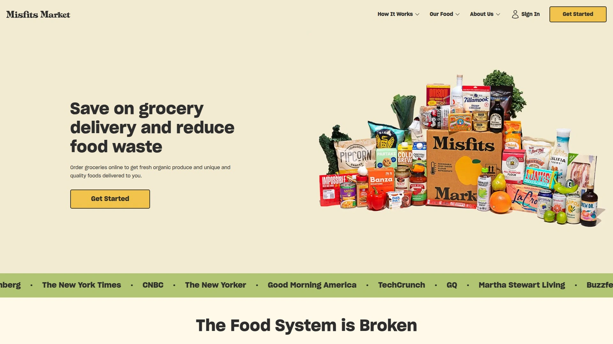

# 最新有机农产品配送服务汇总(内附定价对比)

网站超市的有机蔬菜不新鲜、配送费比菜还贵、每周固定去农贸市场太费时间——这些问题在有机农产品配送服务这里都能解决。从华盛顿州的农场到你家门口,这些服务商直接跳过中间商,把刚采摘的时令蔬果在24-48小时内送到你手上,价格比Whole Foods便宜20-30%。这份榜单覆盖了14家在新鲜度、性价比和配送覆盖范围上表现突出的服务商,从传统CSA订阅到灵活定制菜篮,从全美覆盖到区域精品农场,无论你住在旧金山、洛杉矶还是西雅图,都能找到适合自己饮食习惯和预算的方案。

## **[Full Circle](https://www.fullcircle.com)**

华盛顿州老牌农场直送服务商,430英亩有机认证农场+430家伙伴农场,覆盖阿拉斯加到加州4个州。

Full Circle成立于1997年,从华盛顿州卡纳申的有机农场起家,现在已经发展成年销售额2200万美元、拥有150名员工的西海岸最大有机配送网络之一。公司运营模式是"我们种植、挑选、打包、装箱、配送,你负责享用"。虽然不再自称CSA,但仍保留了社区支持农业的核心理念。

**菜篮定制自由度极高**是最大卖点。会员可以在线从超过80种当季商品中选择,每个地区和季节的选品都不同。提供四种尺寸的蔬果箱,还能添加可持续生产的蛋类、乳制品、肉类、海鲜和谷物。不强制每周订购,可以提前72小时在线修改或跳过订单。

配送方式灵活,既有送货上门服务(Full Circle称之为"产品巅峰"),也有525个自提点可选,自提享受折扣。服务区域从阿拉斯加延伸到加州,东至爱达荷州。所有商品可追溯到具体农场,网站会展示员工和合作农民的故事。

"美好食物生活"博客定期发布农场观察、烹饪技巧和食谱,还会讨论当前农业议题并收集反馈。公司优先选择家庭规模、有强大土地管理实践的农场作为伙伴,要求善待土地和工人。适合重视食物来源透明度、希望支持小农经济、需要灵活订购频率的西海岸家庭。

## **[Misfits Market](https://www.misfitsmarket.com)**

全美覆盖的"丑陋"农产品拯救者,价格比传统超市便宜30%,订单最低15美元起。

Misfits Market专注于拯救因外观问题被超市拒收的优质农产品。这些蔬果可能是尺寸过小的洋葱、形状奇特的南瓜或扭曲的胡萝卜,但营养价值和口感与"完美"农产品完全一样。通过减少食物浪费,让消费者以低于传统超市30%的价格买到有机食材。

**产品线不限于农产品**,还包括有机和常规农产品、动植物蛋白、乳制品和鸡蛋、储藏室主食、饮料、零食甚至葡萄酒。每周更新商品目录,总能发现新奇有趣的食材。包装使用可堆肥的植物基袋子、环保隔热材料和回收纸板。

订单最低15美元起,配送费从6美元开始另加2美元运营费。这种最低消费设计是为了减少包装和碳排放。配送覆盖美国本土48州几乎所有邮编。如果收到的任何商品质量不达标,立即提供补偿或退款。

用户评价集中在"喜欢拯救食物避免浪费"和"每周挑战用当季食材创作新菜品"这两个方面。网站和App界面友好,轻松切换配送日期和窗口。没有会员费,只为订购的商品付费,随时可以取消或跳过订单。适合预算意识强、愿意接受非标准外观农产品、希望减少食物浪费的环保家庭。

## **[Farm Fresh To You](https://www.farmfreshtoyou.com)**

加州Capay Organic农场运营的CSA配送,提供完全可定制的有机农产品箱和天然杂货附加项。

Farm Fresh To You由Capay Organic农场直接运营,确保农产品从农场到餐桌的全程可控。这是真正意义上的农场CSA(社区支持农业)模式,会员直接支持有机农场的可持续发展。农场获得有机认证,采用再生农业实践维护土壤健康。

**菜篮尺寸和搭配灵活多样**。传统CSA箱提供当季有机农产品,会员可以在线自定义选择偏好,跳过不喜欢的食材或增加最爱的蔬果。还能添加天然杂货如面包、奶酪、肉类和储藏室主食。配送已包含在价格中,无需额外支付配送费。

服务区域主要覆盖洛杉矶及周边地区。作为Foodwise农贸市场的参与农场,Farm Fresh To You在旧金山湾区也有一定知名度。网站提供详细的菜篮尺寸对比工具,帮助你找到最适合家庭规模和饮食习惯的方案。

会员反馈称"用了多年,甚至通过社区贷款方式在农场持有小额股份"。这种会员与农场的深度连接是传统CSA的核心价值。适合重视有机认证、希望直接支持本地农场、居住在加州的家庭。

## **[Thrive Market](https://thrivemarket.com)**

会员制有机杂货电商平台,6900多种商品比零售价便宜30%,每购买一个会员就捐赠一个免费会员给有需要的家庭。

Thrive Market的商业模式被形容为"Costco遇上Whole Foods"。通过年度会员制简化供应链,去掉实体超市的加价环节,让有机和非转基因食品的价格降低30%。会员费带来的福利包括折扣、礼品、专属产品合作和订单样品。

**产品线超过6900种**,来自800多个品牌,包括有机和非转基因食品、道德采购的肉类和海鲜、无毒家居和美妆产品、有机和生物动力葡萄酒,以及婴儿和儿童用品。Thrive自有品牌约700种商品,仅会员专享。

搜索筛选功能强大,支持90多种饮食和生活方式偏好,包括纯素、素食、生酮、旧石器时代饮食、公平贸易认证、非转基因项目验证等。2019年成为首家使用Glyphosate Residue Free(无草甘膦残留)认证的零售商。

2020年成为美国首家获得B Corp认证的在线杂货商,2023年完成三个配送中心的TRUE零废弃认证,并达成塑料中和和气候中和。Thrive Gives项目自2015年起已捐赠超过200万份会员资格给有需要的家庭。学生、教师、退伍军人、护士和急救人员可以申请免费会员。

大部分订单免运费。适合追求可持续生活方式、需要多样化有机杂货选择、愿意支付年费以换取长期折扣的家庭。

## **[Imperfect Foods](https://www.imperfectfoods.com)**

"不完美"农产品配送先驱,提供便捷可靠的杂货配送,支持有机/非有机选择和饮食偏好筛选。

Imperfect Foods是"丑陋农产品"运动的早期推动者之一。公司理念是挑战农产品的"美貌标准"——许多形状奇特或颜色不均的蔬果营养价值完全正常,却因为外观被超市拒收。通过给这些农产品新生,让健康饮食变得更实惠。

**网站会明确标注食物"不完美"的原因**,比如是批量生产剩余还是"对商店来说太丑"。鸡蛋、奶酪、肉类和储藏室主食虽然不属于"丑陋"范畴,但Imperfect Foods也提供这些商品,方便一次性搞定所有采购。

配送时间灵活,会通过短信更新配送窗口并可以追踪司机位置。用户实测显示价格与洛杉矶杂货店相当,但"丑陋农产品"同样新鲜美味。包装大部分是环保材料,公司会在下次配送时回收你的冰袋。

测试订单显示:32美元可以买到1磅粉红女士苹果、2个牛油果、1磅胡萝卜、1袋柑橘、1盒草莓、半品脱蓝莓、2个甜椒、1盒有机葡萄西红柿、6个有机玉米饼和1盒Vital Farms放养鸡蛋。性价比出色。

服务区域包括整个旧金山湾区、萨克拉门托、洛杉矶、橙县和俄勒冈州波特兰。适合预算有限、接受非标准外观农产品、重视环保包装的城市家庭。

## **[Greenhearts Family Farm](https://greenheartsfamilyfarm.com)**

旧金山湾区本地CSA农场,距离市区最近的有机农场,提供免费配送且无会员费。

Greenhearts Family Farm在Half Moon Bay拥有自己的农田,是距离旧金山最近的有机农场。这种地理优势让湾区居民可以显著缩短食物里程,甚至可以亲自拜访农场认识农民。公司运营超过15年,在旧金山湾区有稳固的客户基础。

**完全由农民自己运营**是最大特色。农场主亲自种植、采摘、打包和配送CSA箱,回复每一封邮件和电话。这种直接连接让会员与农场建立真正的伙伴关系,而不只是顾客关系。公司的目标是寻找"愿意承诺支持可持续本地农业的邻居"。

每周提供精选的本地时令水果蔬菜和手工食品。所有产品都经过认证有机,来自生态友好、可持续的牧场和有机农场及手工食品生产者。配送完全免费,无需支付会员费。

Yelp评分5.0,236条评价全部为正面。用户评价集中在"农产品超级新鲜""质量始终如一""比Whole Foods便宜且更持久"等方面。适合居住在旧金山湾区、重视食物来源可追溯性、希望直接支持本地小农的家庭。

## **[Hungry Harvest](https://www.hungryharvest.net)**

通过拯救"不完美"农产品对抗食物浪费的区域配送服务,覆盖马里兰、华盛顿特区、弗吉尼亚等东海岸地区。

Hungry Harvest的使命是"拯救"那些因外观瑕疵、形状不规则或尺寸不统一而本该被扔掉的农产品。既然你反正要切碎水果和蔬菜,为什么要浪费那些有斑点、奇形怪状或大小不一的食材呢。通过配送这些本该进入垃圾填埋场的新鲜农产品,公司为食物浪费提供了实际解决方案。

服务区域覆盖马里兰州、华盛顿特区、弗吉尼亚州、大费城地区、新泽西南部、特拉华北部和北卡罗来纳州罗利。这是东海岸主要的"丑陋农产品"配送服务之一。

菜篮提供多种尺寸和蔬果比例选择,还能添加其他杂货商品。定价策略让新鲜农产品比传统超市更实惠。包装使用环保材料,配送频率可以根据需求调整为每周或隔周。

适合居住在东海岸、关注食物浪费问题、预算有限但希望保持健康饮食的家庭。公司的社会使命感吸引了大量价值观驱动的消费者。

## **[Full Belly Farm](https://csa.fullbellyfarm.com)**

北加州知名有机农场CSA,提供周二到周六多个配送日选择,戴维斯和萨克拉门托部分地区可选家庭办公室直送。

Full Belly Farm是北加州地区历史悠久的CSA农场。会员首先需要选择配送地点,可以通过地图或列表视图查看所有自提点。配送日从周二到周六都有安排,给会员充分的时间灵活性。

**家庭和办公室直送服务**是付费增值选项,每次配送额外收费10美元。这个服务仅在戴维斯、萨克拉门托和东湾部分地区提供。如果你的地址在配送范围内,CSA工作人员会分配配送日期并在处理订单时确认。

旧金山地区的家庭配送或其他配送范围外的地区,可以通过Good Eggs直接订购Full Belly Farm的CSA箱。这种与第三方平台的合作扩大了农场的服务半径。

客服联系方式清晰,可以通过csa@fullbellyfarm.com邮件或800-791-2110电话咨询。适合居住在北加州、重视传统CSA模式、希望支持本地有机农场的会员。

## **[Farmer Jones Farm](https://www.farmerjonefarm.com)**

二代家族农场使用再生农业实践,主打"吃彩虹"蔬菜箱,提供积分奖励和捐赠选项。

Farmer Jones Farm是第二代家族经营的农场,采用再生农业实践维护土壤健康,以实现风味浓郁、营养丰富的作物。公司的核心产品是"Eat a Rainbow"(吃彩虹)蔬菜箱,里面装满色彩鲜艳的蔬菜和脆爽的绿叶菜。

**产品线不限于蔬菜**,还销售食用花卉和咖啡等特色商品。会员奖励系统让忠实客户通过积分获得"胡萝卜",可以在未来购买中兑换。这种积分制度增强了客户粘性。

捐赠选项让有爱心的客户可以帮助有需要的人获得健康食物。农场提供捐赠蔬菜箱的功能,支持食物公平和社区互助。配送覆盖全美主要地区。

适合重视土壤健康和再生农业、希望通过购买支持家族农场、有兴趣参与食物捐赠的家庭。公司的环保实践和社会责任吸引了大量价值观驱动的消费者。

## **[Melissa's Produce](https://www.melissas.com)**

专注难寻食材的农产品配送服务,异国水果箱最受欢迎,全美配送但部分州有限制。

Melissa's最初在加州起家,因快速增长而扩展到全美市场。公司的核心竞争力是提供**难以找到的水果、蔬菜、香草和微型蔬菜**。对于渴望新奇食材的消费者来说,Melissa's是首选配送服务。

最受欢迎的是异国水果箱(Exotic Fruit Box)。时令品种可能包括亚洲梨、迷你菠萝、灯笼果、红香蕉、番荔枝等难得一见的水果。每次打开箱子都是探索新食材的冒险。

虽然配送覆盖全美,但亚利桑那、佛罗里达、乔治亚、路易斯安那、德克萨斯和夏威夷等州对特定水果运输有限制。蔬菜爱好者可以选择有机产品和主题蔬菜箱(如绿汁、生酮友好等)。礼品篮也很受欢迎,适合送给美食爱好者。

适合烹饪爱好者、美食探索者、需要特殊食材的专业厨师和希望尝试异国水果的家庭。价格高于常规农产品配送,但独特性和品质值得溢价。

## **[Farm to People](https://farmtopeople.com)**

纽约地区的农场直送平台,每周轮换时令农产品,提供肉类、乳制品、谷物等全品类商品帮助晚餐规划。

Farm to People专注于纽约及周边地区的农场到餐桌配送。平台每周轮换时令农产品,确保会员总能获得当季最新鲜的食材。除了蔬果,还提供肉类、乳制品、谷物和更多商品,一站式解决晚餐规划需求。

**区域化供应链是核心优势**。Farm to People与纽约州和周边地区的小农场建立直接合作关系,缩短了从农场到消费者的距离。这种本地化模式确保了农产品的新鲜度,同时支持了区域农业经济。

菜篮可以根据饮食偏好和家庭规模定制。平台提供清晰的食谱建议,帮助会员充分利用每周收到的食材。配送日和频率灵活,可以随时调整或跳过订单。

适合居住在纽约地区、重视本地采购、需要完整的晚餐食材解决方案的城市家庭。对于忙碌的专业人士来说,一次性解决蔬果和蛋白质采购特别方便。

## **[FarmTaste](https://www.farmtaste.com)**

中西部"农场到门口"配送服务,覆盖伊利诺伊、印第安纳和威斯康星2500个邮编,提供碳水控制、奶酪箱、素食等主题箱。

FarmTaste的使命是"每个人都应该直接获得时令健康的美国种植、制造或养殖的农产品"。这家芝加哥公司将农场直送理念带到中西部,覆盖伊利诺伊、印第安纳和威斯康星州的2500个邮编。

**主题箱选择丰富多样**。除了传统的蔬果箱,还有碳水控制箱(Carb Conscious)、奶酪箱、素食箱等专业分类。每种箱子都包含时令水果蔬菜、香草、肉类、海鲜、乳制品、鸡蛋、冷压果汁和手工产品。纯素选项包括豆类、意大利面和大豆蛋白。

在线订购极其简单,选择菜篮类型后设置配送为一次性、每周或每月即可。为了帮助减少食物浪费,FarmTaste提供以新鲜食材为特色的简易食谱。公司甚至计划推出为宠物设计的全天然农场箱。

适合居住在中西部、遵循特定饮食方式(如生酮、低碳水)、希望支持美国本土农产品的家庭。区域化的配送模式确保了更快的送达速度和更低的碳足迹。

## **[Good Eggs](https://www.goodeggs.com)**

旧金山湾区本地食品配送平台,整合多家CSA农场和手工食品生产商,提供当日或次日送达。

Good Eggs是旧金山湾区领先的本地食品配送平台。平台与多家当地农场和手工食品生产商合作,包括Full Belly Farm等知名CSA农场。这种聚合模式让消费者可以在一个平台上购买多家农场和生产商的产品。

**配送速度快**是核心竞争力。大部分订单提供当日或次日送达,适合临时需要补充食材的情况。产品线覆盖新鲜农产品、肉类、海鲜、乳制品、烘焙食品和储藏室主食。

平台界面友好,可以按照饮食偏好、有机认证、本地采购等标准筛选商品。每个产品都有详细的来源信息,说明来自哪个农场或生产商。对于想要支持本地食品系统但没有时间去农贸市场的城市居民来说,Good Eggs提供了理想的解决方案。

适合居住在旧金山湾区、重视配送速度、希望从多家农场和生产商购买、时间紧张的专业人士和家庭。价格略高于传统CSA,但便利性和速度值得溢价。

## **[Planet Organics](https://www.planetorganics.com)**

提供全面定制选项的有机配送服务,可调整蔬果数量和比例,附带杂货订购功能类似Webvan。

Planet Organics让会员可以设置每周配送,不同尺寸和不同蔬果比例的当季菜篮完全可定制。但最让用户喜欢的是**可以同时订购杂货**——牛奶、面包、奶酪、肉类、Annie's品牌产品等,这是最接近已倒闭的Webvan服务的替代方案。

价格与Whole Foods相当,不算便宜但质量很高。公司会告知食材来源,尽量采购小型本地农场的产品。虽然部分农产品来自较大农场,但透明度做得不错,会持续更新来源信息。

订单下达后,会员还有机会在发货前修改订单和添加杂货。这种灵活性让你可以根据临时需求调整采购清单。用户反馈称使用服务已有四年,质量稳定可靠。

适合预算较宽裕、希望一次性解决蔬果和杂货采购、重视食材来源透明度的家庭。比CSA贵,但比Whole Foods便宜,且提供送货上门的便利。

## 常见问题

**CSA订阅和常规配送有什么区别?**

传统CSA(社区支持农业)通常要求预付整个季度或年度费用,你会收到农场当季种植的任何蔬果,选择权有限。比如Full Belly Farm和Greenhearts Family Farm就是典型的CSA模式。常规配送服务如Misfits Market和Imperfect Foods则更灵活,可以每周在线定制选择,跳过不想要的食材,只为实际订购的商品付费。CSA更强调支持本地农场和季节性饮食,配送服务则侧重便利性和选择自由。

**"丑陋"农产品真的安全新鲜吗?**

完全安全且新鲜。这些农产品只是外观不符合超市的"美貌标准",比如尺寸太小、形状奇特或颜色不均匀,但营养价值、口感和保鲜期与"完美"农产品完全一样。实际测试显示Misfits Market和Imperfect Foods的农产品完全成熟、脆爽且即食,只是视觉特征有些许不一致。如果收到质量不达标的商品,这些公司都提供退款或补偿保证。

**配送费一般多少钱?**

差异很大,从免费到十几美元不等。Greenhearts Family Farm和Farm Fresh To You提供完全免费的配送。Misfits Market配送费从6美元起另加2美元运营费。Full Circle的送货上门服务需要支付配送费,但自提点取货可以享受折扣。Full Belly Farm的家庭直送额外收费10美元。建议对比总成本而非只看菜篮价格,有些服务虽然产品价格高但包含免费配送,算下来可能更划算。

## 结语

从有机认证农场到异国水果探索,选对配送服务能让健康饮食变得更简单、更实惠、更可持续。如果你居住在西海岸、重视食材来源透明度和订购灵活性,[Full Circle](https://www.fullcircle.com)的430英亩有机农场基础、525个自提点覆盖和72小时内可修改订单的政策特别适合需要高度定制化且希望支持可持续农业的家庭。选择时记得先明确自己的核心需求——预算范围、配送区域、饮食偏好、每周需求量——然后利用首次订单折扣或免费试用测试农产品新鲜度和配送准时性,找到最契合生活方式的那一家。
